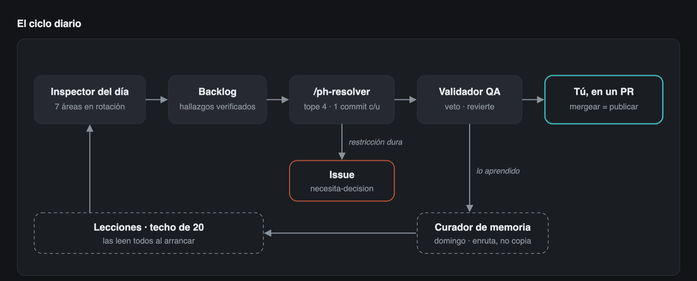

# Phronesis v2.3

**Agentes de Claude Code para la mejora continua de un producto real.** Cada día inspeccionan un
área de tu proyecto, arreglan lo que se puede arreglar sin ti, validan que nada se rompa y te dejan
todo en un solo PR para que decidas. Una vez por semana consolidan lo aprendido para no repetir errores.

**Versión 2.3.0** (2026-10-09) · [qué cambió en cada versión](CHANGELOG.md)



> *Phronesis v2* (φρόνησις) es la palabra que Aristóteles usaba para la **sabiduría práctica**: saber
> qué hacer en una situación concreta, algo que no se aprende de un manual sino equivocándose y
> corrigiendo. Estos agentes son eso: el criterio que dejaron meses de errores reales, escrito para
> que otro proyecto no tenga que pagarlos de nuevo.

---

## Índice

- [De dónde viene](#de-dónde-viene)
- [Cómo funciona](#cómo-funciona)
- [Los agentes](#los-agentes) · [cómo se mueve el equipo](organigrama/)
- [Los comandos](#los-comandos)
- [Instalación paso a paso](#instalación-paso-a-paso)
- [El día a día](#el-día-a-día)
- [Cómo mejora con el tiempo](#cómo-mejora-con-el-tiempo)
- [Seguridad: lo que los agentes nunca hacen](#seguridad-lo-que-los-agentes-nunca-hacen)
- [Límites honestos](#límites-honestos)
- [Estructura del repo](#estructura-del-repo)
- [Qué cambió de la v1 a la v2](#qué-cambió-de-la-v1-a-la-v2) · [registro de cambios](CHANGELOG.md)

---

## De dónde viene

Phronesis v2 no se diseñó en una pizarra. Nació operando **[Avisia](https://avisia.cl)**, un
marketplace de avisos clasificados en Chile, con usuarios reales, pagos reales y despliegues diarios.
Durante meses, estos agentes inspeccionaron, arreglaron y desplegaron Avisia todos los días, y cada
error que cometieron quedó escrito en sus instrucciones. Avisia es el banco de pruebas de Phronesis:
cada regla de este repo se pagó ahí primero. En Avisia:

| | |
|---|---|
| Hallazgos de los inspectores | **161** |
| Items del backlog resueltos | **181 de 196** |
| Despliegues registrados y verificados | **53** |
| Lecciones generalizadas en [LECCIONES.md](LECCIONES.md) | **27** |
| Reescrituras de la instrucción del agente de deploy | **19** |

Ese último número importa: un agente no aprende solo, lo único que persiste es su archivo de
instrucciones. **Cada reescritura es un error real que quedó escrito.** Al pasar a Phronesis v2 se
quitaron el stack, las rutas y el dominio de Avisia, y quedó el criterio: funciona en cualquier
proyecto que tenga código, un repo y alguien que decida.

**[Cómo se mueve el equipo de agentes →](organigrama/)** — quién le pasa trabajo a quién, qué
valor da cada uno y cómo se configura. Incluye el organigrama con la historia de cada agente en Avisia.

---

## Cómo funciona

### El ciclo diario (`/ph-ciclo`)

1. **Inspecciona** un área según la rotación del día: lunes seguridad, martes SEO, miércoles código,
   jueves UX, viernes accesibilidad, sábado performance, domingo descanso. Si declaraste un foco de
   negocio, también lo mira.
2. **Anota** los hallazgos en un backlog versionado en tu repo, después de verificar que son reales.
3. **Resuelve** hasta 4 items en tu rama de integración (por ejemplo `staging`), un commit por item.
4. **Valida**: typecheck, build y humo con el servidor levantado. Si algo se rompe, lo arregla o
   **revierte** el commit culpable. La rama nunca queda peor que antes.
5. **Te deja un PR** hacia producción con todo lo que cambió. Revisas, mergeas o rechazas. **Mergear
   es publicar; ningún agente lo hace por ti.**

Si un día no encuentra nada, no se queda en cero: **paga una deuda** de tu registro de deudas. Y si
tampoco hay deuda que pueda pagar sola, lo dice. No inventa trabajo para verse ocupado.

### La memoria semanal (`/ph-memoria`)

Cada domingo, el curador lee lo que pasó en la semana (resoluciones, reverts, incidentes de deploy) y
decide a dónde va cada aprendizaje: a las lecciones activas, a la guía de tu proyecto o al archivo del
agente que corresponde. **Nunca copia: enruta.** Y mantiene un techo de 20 lecciones activas, porque
cada línea de más la pagan todos los agentes, todos los días.

### Las tres reglas que comparten todos

- **Un hallazgo es una hipótesis, no un hecho.** Antes de reportar algo, el agente abre el archivo y
  comprueba la premisa. Un hallazgo con todo el formato correcto puede estar igual de equivocado.
- **Un hallazgo rara vez está solo.** Antes de darlo por único, busca a sus hermanos: la acción
  inversa, la otra copia del mismo texto, el otro archivo con el mismo patrón.
- **Las restricciones duras no se tocan.** Migraciones, pagos, autenticación y permisos, borrado de
  datos, y lo que tú agregues. Si un hallazgo cae ahí, el agente no lo arregla: abre un Issue con la
  etiqueta `necesita-decision` y la decisión concreta que necesita de ti.

### Un solo archivo de configuración

Los agentes son genéricos. Todo lo específico de tu proyecto —stack, rutas, idioma, restricciones,
comandos de validación, ramas— vive en **un archivo, `PHRONESIS.md`, en la raíz de tu repo**. Los
agentes lo leen antes de trabajar; tú nunca tienes que editar un agente para adaptarlo.

---

## Los agentes

Diecinueve agentes en cuatro plugins. Instala solo los que necesites; `mejora` es el corazón.

### Plugin `mejora` — el loop de mejora continua

| Agente | Qué hace | Cuándo corre |
|---|---|---|
| `ph-inspector-seguridad` | Control de acceso a datos, credenciales mal usadas, funciones de base de datos que quedaron ejecutables por el público, secretos, endpoints sin límite de frecuencia, IDOR, datos personales expuestos. | lunes |
| `ph-inspector-seo` | Metadata por ruta, datos estructurados, canonical, coherencia entre sitemap y `noindex`, URLs inválidas que devuelven 500 en vez de 404, páginas vacías indexadas. Su vara es la documentación de Google, no los blogs. | martes |
| `ph-inspector-codigo` | Adherencia a tu arquitectura, duplicación recién nacida (el momento más barato de unificar), código muerto, tipos, restricciones del framework que el typecheck no ve. | miércoles |
| `ph-inspector-ux` | Fricción en tu flujo principal, estados vacío/carga/error, deep-links que pierden el destino tras el login, confianza, microcopy. Usa las heurísticas de Nielsen, el recorrido cognitivo y la severidad de NN/g. **Nunca decide producto**: eso te lo deja a ti. | jueves |
| `ph-inspector-a11y` | WCAG 2.1 AA: contraste (también el del anillo de foco), foco que se pierde al cerrar un modal, controles solo de mouse, estados que solo se ven y no se anuncian. | viernes |
| `ph-inspector-performance` | Core Web Vitals, bundle, imágenes, consultas N+1, la misma consulta repetida en un request, límites de CPU del runtime. | sábado |
| `ph-inspector-negocio` | Mira lo que la gente hizo, no el código. Trabaja la serie de métricas, prohíbe porcentajes sobre menos de 30 casos y entrega **un** hallazgo, no un tablero. | durante una ventana de foco |
| `ph-validador-qa` | Typecheck, chequeos, build y humo real. Tiene veto: arregla lo obvio y revierte lo demás. | cierre de cada ciclo |
| `ph-curador-memoria` | Cosecha lo aprendido, consolida lecciones repetidas, las enruta a un solo destino y sostiene el techo de 20. Cero lecciones nuevas es un buen resultado. | domingo |
| `ph-sintetizador-usabilidad` | Convierte notas de un test con usuarios en items del backlog, sin inventar nada. | cuando le das notas |

### Plugin `ops` — operación

| Agente | Qué hace | Cuándo corre |
|---|---|---|
| `ph-gestor-deploy` | Ejecuta el **protocolo de deploy en 12 fases**: un inventario que falla si algo queda fuera del merge, pre-flight, riesgo y punto de retorno fijados antes, revisión de casos hermanos, verificación visual, una **puerta que espera tu «mergea»**, una última mirada a quién más está trabajando antes de mergear, verificación en producción, observación, registro y nota de release. | cada deploy, con `/ph-deploy` |
| `ph-verificador-deploy` | El subagente de la fase de verificación: prueba que la versión correcta está viva comparando el commit servido, distingue tu falla de la del proveedor y verifica en vivo un cambio concreto. No cree en el verde del CI. | fase F8 de cada deploy |
| `ph-triage-correo` | Dice qué correo exige acción, de quién y para cuándo; calcula plazos legales; detecta lo que debió llegar y no llegó, y los filtros que esconden correos. Solo lectura. | cada noche |
| `ph-vigilante-rutinas` | Distingue «no arrancó», «arrancó y no terminó» y «corrió sin entregar nada». Vigila el entregable, no solo el latido. | cada día |

### Plugin `growth` — outreach B2B

| Agente | Qué hace | Cuándo corre |
|---|---|---|
| `ph-prospector` | Suma pocos prospectos de calidad desde fuentes públicas, verifica el dominio y respeta un tope duro. Nunca inventa un dato de contacto. | cada corrida |
| `ph-copywriter` | Escribe en tu voz, de igual a igual. Regla de oro: **nunca le describe su negocio al destinatario**. Checklist anti-spam y segundo toque solo a quien no respondió. | cada corrida |
| `ph-estratega` | Mide el canal por rubro contra umbrales que disparan solos (rebote en ventana móvil, 20 contactos sin respuesta) y escribe el hallazgo en el backlog. Sin cuota. | cierre de cada corrida |

### Plugin `contenido` — redes sociales

| Agente | Qué hace | Cuándo corre |
|---|---|---|
| `ph-director-arte` | Revisa cada pieza contra tu sistema visual, rechaza historias sin mensaje o con botones dibujados que no funcionan, y propone cómo evoluciona el estilo. | cada tanda |
| `ph-jefe-copy` | **Cuenta antes de opinar**: rayas largas, ganchos de más de 125 caracteres, vocabulario corporativo. Reescribe lo que suena a IA. | cada tanda |

---

## Los comandos

| Comando | Qué hace |
|---|---|
| `/ph-iniciar` | Prepara un proyecto: lee tu repo, escribe `PHRONESIS.md` y crea el backlog, las lecciones y el registro de deudas. Se corre una vez. |
| `/ph-ciclo [área]` | La corrida diaria completa: sincroniza ramas, revisa tus decisiones pendientes, inspecciona, resuelve, valida y resume. |
| `/ph-inspeccionar [área]` | Solo la inspección. No toca código. |
| `/ph-resolver [tope]` | Solo la resolución, con el validador al final. |
| `/ph-memoria` | La curaduría semanal de lecciones. |
| `/ph-usabilidad <notas>` | De notas de un test con usuarios a items del backlog. |
| `/ph-deploy [estado\|mergea\|todo]` | *(plugin `ops`)* El protocolo de deploy. Sin argumentos llega hasta la puerta y espera tu «mergea»; `estado` solo muestra el inventario. |

---

## Instalación paso a paso

### 0. Lo que necesitas

- [Claude Code](https://docs.claude.com/claude-code) instalado y con sesión iniciada.
- Un proyecto en `git`, idealmente en GitHub.
- [`gh`](https://cli.github.com/) (la CLI de GitHub) con sesión iniciada, para los Issues y los PR.
- Dos ramas: una de **integración** donde trabaja el loop (por ejemplo `staging`) y una de
  **producción** (por ejemplo `main`). Si no tienes la de integración:

  ```bash
  git switch -c staging && git push -u origin staging
  ```

### 1. Instala los plugins

Dentro de Claude Code:

```
/plugin marketplace add Clagoss/phronesis-v2
/plugin install mejora@phronesis-v2
```

Y los opcionales que te sirvan:

```
/plugin install ops@phronesis-v2
/plugin install growth@phronesis-v2
/plugin install contenido@phronesis-v2
```

> **¿Vas a correr el loop en GitHub Actions?** Allá no hay marketplace de plugins: los agentes tienen
> que estar dentro de tu repo. Clona Phronesis v2 y cópialos con el instalador (no sobrescribe nada que
> ya exista):
>
> ```bash
> git clone https://github.com/Clagoss/phronesis-v2.git
> ./phronesis-v2/scripts/instalar.sh /ruta/a/tu-proyecto mejora ops
> ```

### 2. Prepara tu proyecto

Abre Claude Code en la raíz de tu proyecto y corre:

```
/ph-iniciar
```

Lee tu repo (stack, migraciones, scripts de validación, ramas, idioma), escribe `PHRONESIS.md` con lo
que dedujo y te hace solo tres preguntas: qué es tu producto, qué restricciones duras propias tienes y
cuál es el flujo que más importa. También crea `docs/mejora/BACKLOG.md`, `docs/mejora/LECCIONES.md`,
`docs/DEUDAS.md` y la etiqueta `necesita-decision` en GitHub.

### 3. Revisa `PHRONESIS.md` (la parte que más vale)

Abre el archivo y revisa sobre todo dos secciones:

- **Restricciones duras.** Lo que ningún agente puede tocar por su cuenta. Las cuatro por defecto
  (migraciones, pagos, autenticación y permisos, borrado de datos) son un piso, no un techo. Agrega
  lo tuyo: temas legales, categorías sensibles, datos de menores, integraciones con terceros.
- **Validación.** Los comandos exactos de typecheck, build y humo, y las rutas críticas. Si un
  comando no existe, escribe «no existe»: el validador lo va a reportar en vez de saltárselo en
  silencio.

La [plantilla completa](plantillas/PHRONESIS.md) explica cada campo.

### 4. Primera corrida a mano

Antes de automatizar nada, mira cómo trabaja:

```
/ph-inspeccionar seguridad
```

Lee lo que encontró en el backlog. Si algo no aplica, márcalo `rechazado` y di por qué: es la mejor
forma de calibrarlo. Después resuelve uno solo:

```
/ph-resolver 1
```

Mira el commit, el veredicto del validador y la resolución anotada en el backlog. Si te gusta cómo
trabaja, sigue al paso 5.

### 5. El ciclo diario en la nube

Así el loop corre aunque tu computador esté apagado.

1. Genera un token de Claude Code y guárdalo como secret del repo:

   ```bash
   claude setup-token
   ```

   ```bash
   gh secret set CLAUDE_CODE_OAUTH_TOKEN
   ```

2. Copia la plantilla del workflow:

   ```bash
   mkdir -p .github/workflows && cp /ruta/a/phronesis-v2/plantillas/github/ciclo-diario.yml .github/workflows/
   ```

3. Abre el archivo y ajusta lo marcado con `AJUSTA`: los nombres de tus ramas, la hora (en UTC) y
   los pasos para instalar dependencias, para que el validador pueda compilar.
4. Commitea, pushea y pruébalo a mano antes de esperar al cron:

   ```bash
   gh workflow run ciclo-diario.yml -f area=seguridad
   ```

5. Cuando termine, revisa el PR que abrió de tu rama de integración hacia producción.

### 6. La memoria semanal

Igual que el paso anterior, con [`plantillas/github/memoria-semanal.yml`](plantillas/github/memoria-semanal.yml).
Corre los domingos, que es el día que el ciclo descansa: así nadie más escribe en la rama.

### 7. Opcional: los demás plugins

- **`ops` — despliegues.** El instalador deja en tu proyecto el script de inventario
  (`scripts/ops/inventario-deploy.mjs`, con `orden-migraciones.mjs`, que lee si una migración va al
  merge o después) y tres archivos en `docs/ops/`: `deploy.json` (ramas, URL de
  salud, **rutas sensibles por nivel de riesgo**), `fuera-del-lote.json` (lo que dejas fuera a
  propósito, con motivo) y `protocolo-revision.json` (cuándo revisar el protocolo). Ajusta
  `deploy.json`, llena la §7 de `PHRONESIS.md` y expón el commit del build en un endpoint de salud
  (por ejemplo `/api/health` devolviendo `{"commit": "abc1234"}`): convierte la verificación en una
  prueba en vez de una suposición. Después corre `/ph-deploy estado` para ver el inventario sin tocar
  nada.
- **`ops` — correo.** Necesitas un conector de correo en Claude Code (por ejemplo el de Gmail).
  Copia [`plantillas/correo.json`](plantillas/correo.json) a `docs/ops/correo/<proyecto>.json` y
  ajusta casillas, categorías y plazos. Prográmalo como tarea diaria.
- **`ops` — rutinas.** Copia [`plantillas/rutinas.json`](plantillas/rutinas.json) y declara cada
  automatización con su frecuencia y **su entregable**.
- **`growth` y `contenido`.** Llena las secciones *Outreach* y *Contenido* de `PHRONESIS.md` con tu
  plan, tu voz, tu oferta y tu sistema visual. Sin eso, los agentes se abstienen.

---

## El día a día

Una vez instalado, tu trabajo se reduce a cuatro cosas:

1. **Moderar el PR.** Mira el ambiente de integración y el diff. Mergea lo que te gusta; para lo que
   no, revierte el commit en la rama de integración o deja un comentario. Ese es todo el control.
2. **Responder los Issues `necesita-decision`.** Comenta tu decisión («aprobado, opción A») y el
   siguiente ciclo la toma, actualiza el item y cierra el Issue.
3. **Renovar la ventana de foco de negocio** cuando venza, si quieres que el inspector de negocio
   siga mirando. El ciclo te avisa cuando venció.
4. **Pasarle notas de usuarios** con `/ph-usabilidad` cuando hagas un test.

---

## Cómo mejora con el tiempo

Phronesis v2 aprende en tres niveles:

1. **Lecciones del proyecto** — `docs/mejora/LECCIONES.md` en tu repo. Las escriben los agentes cuando
   ven un patrón y las cura `ph-curador-memoria` cada semana. Las leen todos al arrancar.
2. **Reglas del proyecto** — cuando una lección se repite en dos áreas, el curador la promueve a tu
   `CLAUDE.md` y pasa a valer para todos, humanos incluidos.
3. **El oficio de cada agente** — cuando una lección es el trabajo de un solo rol, se baja a su
   archivo. Por eso conviene versionar los agentes en tu repo (con `scripts/instalar.sh`): sus
   reescrituras son tu aprendizaje.

[LECCIONES.md](LECCIONES.md) es el tercer nivel aplicado a Phronesis v2 mismo: 27 patrones con el error
que los originó, la regla y cómo detectarlo. Si tu proyecto descubre uno que vale para cualquiera,
abre un PR.

---

## Seguridad: lo que los agentes nunca hacen

- **Nunca despliegan a producción ni mergean el PR.** Eso es tuyo.
- **Nunca tocan las restricciones duras.** Abren un Issue.
- **Los inspectores son de solo lectura.** Solo el resolutor y el validador modifican código, y solo
  en la rama de integración.
- **El validador revierte ante la duda.** Rehacer un item mañana cuesta poco; romper producción, mucho.
- **El triage de correo nunca responde, archiva ni marca como leído.**
- **Ninguna credencial poderosa va a GitHub Actions.** Las claves de servicio de tu base de datos se
  quedan en tu máquina. Los chequeos que las necesitan corren en local, antes de desplegar; la nube
  trabaja con lo que el repo ya tiene.

---

## Límites honestos

- **Cuesta tokens.** Un ciclo diario con inspección, resolución y build consume una parte real de tu
  plan. El tope de 4 items y la rotación por área existen también por eso.
- **Los runners gratuitos de GitHub se atrasan.** Un cron puede disparar con minutos u horas de
  retraso, sobre todo en el minuto cero. Las plantillas ya usan minutos impares, pero no esperes
  puntualidad.
- **Muchos sitios bloquean las IPs de centros de datos.** Un humo contra tu sitio en producción desde
  GitHub Actions puede dar un falso rojo. Verifica desde una máquina normal cuando sea el caso.
- **Los agentes leen `PHRONESIS.md` al pie de la letra.** Un campo vacío produce abstención, no
  creatividad. Es a propósito.
- **Está escrito en español.** Las instrucciones, las plantillas y los mensajes. Funciona sobre
  proyectos en cualquier idioma (el idioma de la interfaz se declara en `PHRONESIS.md`), pero el
  equipo que lo modera tiene que leer español.

---

## Estructura del repo

```
phronesis-v2/
├── .claude-plugin/marketplace.json   el marketplace: declara los 4 plugins
├── plugins/
│   ├── mejora/      7 inspectores, validador, curador, sintetizador + 6 comandos
│   ├── ops/         gestor y verificador de deploy, triage de correo, vigilante de rutinas + /ph-deploy
│   ├── growth/      prospector, copywriter, estratega
│   └── contenido/   director de arte, jefe de copy
├── plantillas/
│   ├── PHRONESIS.md          el único archivo que adaptas a tu proyecto
│   ├── BACKLOG.md · LECCIONES.md · DEUDAS.md
│   ├── rutinas.json · correo.json
│   ├── deploy.json · fuera-del-lote.json · protocolo-revision.json
│   ├── scripts/              inventario-deploy.mjs · orden-migraciones.mjs (F1 y F3 del protocolo de deploy)
│   └── github/               ciclo-diario.yml · memoria-semanal.yml
├── scripts/instalar.sh       copia agentes y comandos a .claude/ de tu proyecto
├── organigrama/              cómo se mueve el equipo, el valor de cada agente y el organigrama
├── LECCIONES.md              27 patrones aprendidos en producción
└── CHANGELOG.md              qué cambió en cada versión
```

---

## Qué cambió de la v1 a la v2

- **De 7 a 19 agentes**, y de agentes sueltos a un loop completo con comandos que lo orquestan.
- **`PHRONESIS.md`**: los agentes ya no traen rutas de otro proyecto que había que reemplazar a mano.
- **Un inspector por área** (la v1 tenía dos auditores generales), más el inspector de negocio, el
  curador de memoria y el vigilante de rutinas, que son nuevos.
- **Tres reglas transversales** en todos los inspectores: verificar la premisa, buscar hermanos,
  respetar las restricciones duras.
- **El estratega de outreach** pasó de pedir «1 a 3 oportunidades por día» a umbrales que disparan
  solos, después de que la versión anterior dejara un hallazgo en dos meses.
- **Protocolo de deploy en 12 fases** (F0–F11), con un inventario que falla si algo queda fuera del
  merge, el riesgo del lote calculado por rutas sensibles, una puerta que espera tu «mergea» y una
  nota de release al final. Viene del deploy management de Avisia, deploys #18 a #48.
- **Plantillas de GitHub Actions** para correr todo en la nube.
- **12 lecciones nuevas** en [LECCIONES.md](LECCIONES.md).

Lo que vino después de la 2.0 está en el [registro de cambios](CHANGELOG.md).

---

Hecho por [Carlos Lagos](https://github.com/Clagoss). Licencia [MIT](LICENSE).
