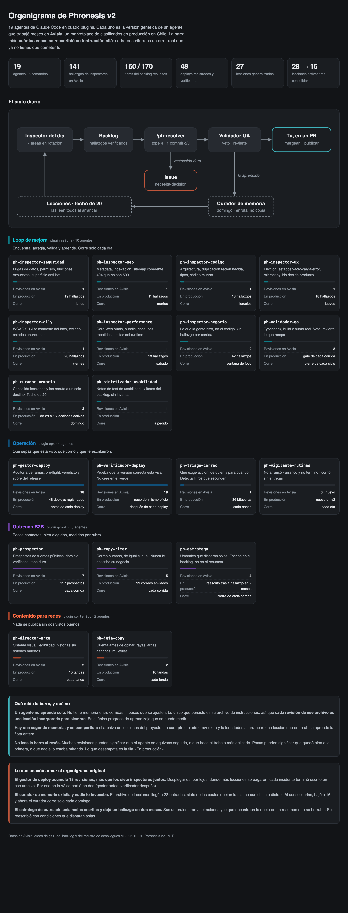
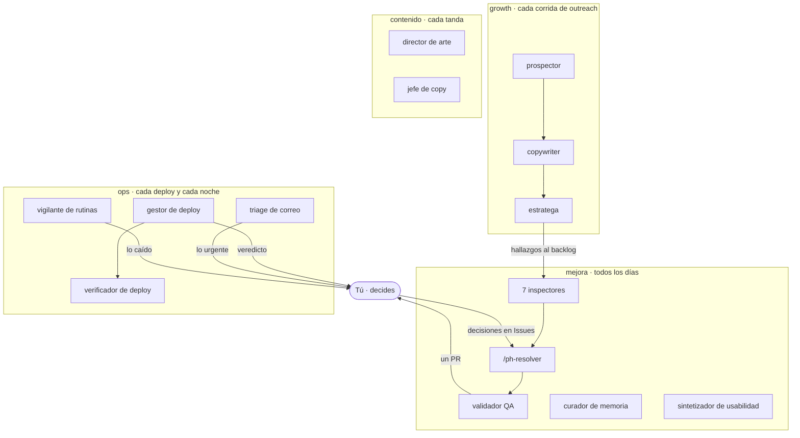
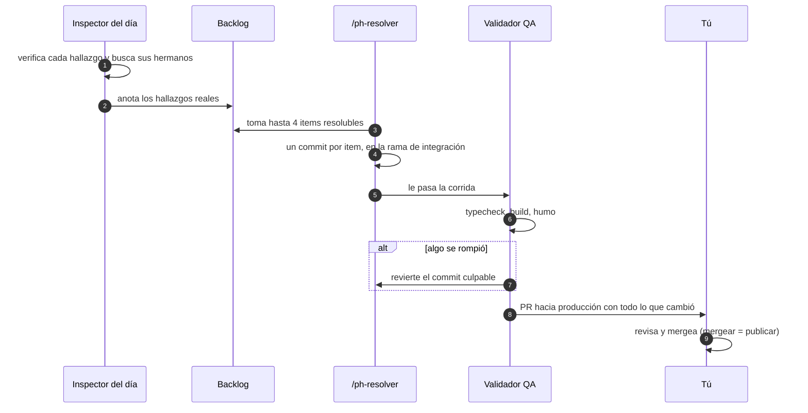
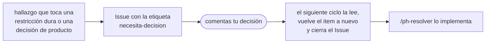
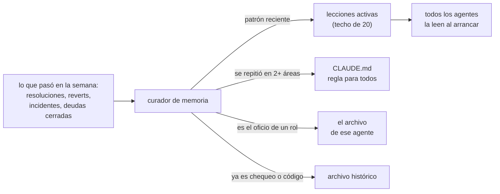
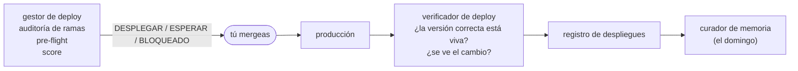
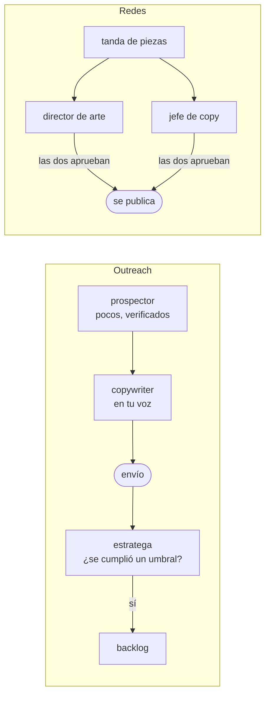

# Cómo se mueve el equipo de Phronesis v2

Phronesis v2 no son 19 herramientas sueltas: es **un equipo**, con roles que se pasan el trabajo
entre ellos y una sola persona que decide, tú. Este documento explica cómo se organiza ese equipo,
qué valor da cada agente, qué pasa si falta, y cómo se configura cada uno.

> La captura viene de [`organigrama.html`](organigrama.html). GitHub muestra el código de los
> archivos HTML: para verlo como página, descárgalo y ábrelo en tu navegador.

---

## Índice

1. [El equipo, como si fuera un equipo humano](#1-el-equipo-como-si-fuera-un-equipo-humano)
2. [Una semana del equipo](#2-una-semana-del-equipo)
3. [Cómo se pasan el trabajo](#3-cómo-se-pasan-el-trabajo)
4. [Los archivos que comparten](#4-los-archivos-que-comparten)
5. [El valor de cada agente](#5-el-valor-de-cada-agente)
6. [Por dónde empezar](#6-por-dónde-empezar)
7. [Cómo configurar cada agente](#7-cómo-configurar-cada-agente)
8. [Señales de que el equipo funciona, y de que no](#8-señales-de-que-el-equipo-funciona-y-de-que-no)

---

## 1. El equipo, como si fuera un equipo humano

La forma más fácil de entender Phronesis v2 es pensarlo como un equipo de producto chico:

| En un equipo humano | En Phronesis v2 | Qué hace |
|---|---|---|
| **El dueño del producto** | **tú** | Decide qué sale a producción y resuelve lo que los agentes no pueden decidir. Es el único rol que no se automatiza. |
| Los auditores especialistas | los 7 inspectores | Cada uno revisa un área un día de la semana y anota lo que encuentra. No tocan código. |
| El desarrollador | `/ph-resolver` | Implementa lo que el backlog pide, un cambio pequeño por vez. |
| QA | `ph-validador-qa` | Comprueba que nada se rompió. Tiene veto: revierte lo que falle. |
| El que escribe los post-mortems | `ph-curador-memoria` | Cada semana convierte lo que salió mal en reglas para que no vuelva a pasar. |
| El encargado de releases | `ph-gestor-deploy` + `ph-verificador-deploy` | Antes del deploy decide si es el momento; después prueba que salió bien. |
| La secretaria y el de guardia | `ph-triage-correo` + `ph-vigilante-rutinas` | Te dicen qué correo exige acción y qué automatización dejó de funcionar. |
| El equipo comercial | prospector, copywriter, estratega | Buscan clientes, les escriben y miden qué funciona. |
| El equipo de marca | director de arte, jefe de copy | Nada se publica en redes sin pasar por ellos. |

**La regla que sostiene todo:** los agentes hacen el trabajo; tú decides. Ningún agente despliega a
producción, mergea un PR, toca una restricción dura ni manda un correo a un cliente por su cuenta.

---

## 2. Una semana del equipo

| Día | Quién trabaja | Qué te llega |
|---|---|---|
| **Lunes** | inspector de seguridad → resolutor → validador | PR actualizado |
| **Martes** | inspector de SEO → resolutor → validador | PR actualizado |
| **Miércoles** | inspector de código → resolutor → validador | PR actualizado |
| **Jueves** | inspector de UX → resolutor → validador | PR + Issues si hubo decisiones de producto |
| **Viernes** | inspector de accesibilidad → resolutor → validador | PR actualizado |
| **Sábado** | inspector de performance → resolutor → validador | PR actualizado |
| **Domingo** | curador de memoria | un commit `memoria:` con lo aprendido, o nada si la semana fue limpia |
| **Cada noche** | triage de correo, vigilante de rutinas | un reporte corto; vacío si todo está bien |
| **Si declaraste un foco** | inspector de negocio, encima de la rotación | un hallazgo de negocio por corrida |
| **Cuando despliegas** | gestor de deploy → tú → verificador de deploy | veredicto antes, confirmación después |
| **Cuando corre el outreach** | prospector → copywriter → estratega | correos listos y el estado del canal |
| **Cuando hay una tanda de redes** | director de arte + jefe de copy | aprobado o corregir, pieza por pieza |

Tu parte de la semana, si todo funciona: revisar el PR, mergear lo que te gusta, contestar los
Issues `necesita-decision` y leer los reportes cuando dicen algo.

---

## 3. Cómo se pasan el trabajo

### El ciclo diario

Si la inspección no encontró nada resoluble, el resolutor **paga una deuda** del registro de deudas.
Si tampoco hay deuda que pueda pagar sola, lo dice. Nunca inventa trabajo.

### Cuando algo necesita tu decisión

Las restricciones duras por defecto son migraciones, pagos, autenticación y permisos, y borrado de
datos. Tú agregas las tuyas en `PHRONESIS.md`.

### La memoria semanal

### Un despliegue

### Outreach y contenido

---

## 4. Los archivos que comparten

Los agentes no se hablan entre sí: se coordinan por archivos versionados en tu repo. Eso hace que
todo quede en `git`, que se pueda revisar y que se pueda revertir.

| Archivo | Lo escriben | Lo leen |
|---|---|---|
| `PHRONESIS.md` | tú (con ayuda de `/ph-iniciar`) | **todos**, antes de trabajar |
| `docs/mejora/BACKLOG.md` | inspectores, estratega, sintetizador, resolutor (estados), validador (auditoría) | resolutor, curador, inspectores (para no duplicar) |
| `docs/mejora/LECCIONES.md` | curador; cualquier agente que vea un patrón | **todos**, al arrancar |
| `docs/DEUDAS.md` | tú, gestor de deploy, resolutor (al pagar una) | resolutor, curador |
| registro de despliegues | gestor y verificador de deploy | gestor (paso 0), curador |
| Issues `necesita-decision` | resolutor | tú; el ciclo diario, para ver si ya decidiste |
| el PR hacia producción | el workflow del ciclo diario | tú |
| `CLAUDE.md` | curador (al promover una regla), tú | todos, humanos incluidos |

---

## 5. El valor de cada agente

Para cada agente: qué valor da, qué pasa si no está, un caso real de Avisia (el proyecto donde nació
Phronesis v2) y qué tan importante es.

**Importancia:** ⭐⭐⭐ imprescindible · ⭐⭐ muy recomendado · ⭐ según tu proyecto.

### Plugin `mejora`

#### `ph-inspector-seguridad` ⭐⭐⭐
- **Valor:** encuentra lo que nadie nota porque no da error: datos expuestos, permisos de más,
  funciones que cualquiera puede llamar.
- **Sin él:** los problemas de seguridad se descubren cuando alguien los explota.
- **En Avisia:** los usuarios con sesión podían leer columnas con datos personales que el público no
  veía. La aplicación funcionaba perfecto, y ese era el problema: el error es silencioso por
  definición. Hoy lo vigila un chequeo automático antes de cada deploy.

#### `ph-inspector-seo` ⭐⭐
- **Valor:** que Google encuentre y entienda tu sitio sin instrucciones contradictorias.
- **Sin él:** páginas que se piden indexar y a la vez se marcan `noindex`, errores 500 que Google lee
  como «este sitio está roto».
- **En Avisia:** las alertas de «Error de servidor» de Search Console venían de un identificador mal
  formado que tiraba una excepción en vez de un 404.

#### `ph-inspector-codigo` ⭐⭐⭐
- **Valor:** atrapa la deuda en el momento más barato: el día que nace.
- **Sin él:** la duplicación se ramifica y cada copia arrastra sus propios bugs.
- **En Avisia:** un `export const` en un archivo de acciones del servidor dejó once acciones
  devolviendo error durante 50 minutos. El typecheck no lo vio; ahora es parte de su remit.

#### `ph-inspector-ux` ⭐⭐
- **Valor:** mira tu producto como alguien que lo usa por primera vez.
- **Sin él:** estados de error que dicen «algo salió mal», enlaces de correo que mandan al inicio en
  vez de a la página prometida.
- **Ojo:** nunca decide producto. Lo que implica cambiar un flujo te lo deja como Issue.

#### `ph-inspector-a11y` ⭐⭐
- **Valor:** que tu producto funcione con teclado y con lector de pantalla.
- **Sin él:** foco invisible, botones que solo responden al mouse, errores que solo se ven en rojo.
- **En Avisia:** el anillo de foco tenía contraste 1,76:1 y 22 archivos lo apagaban. Fue el inspector
  con más hallazgos de su grupo: 20.

#### `ph-inspector-performance` ⭐⭐
- **Valor:** que el sitio cargue rápido y que no pagues de más en infraestructura.
- **Sin él:** consultas repetidas en cada página, imágenes enormes, el runtime cortando por tiempo.
- **En Avisia:** la sesión del usuario se pedía dos veces en el mismo render porque dos componentes la
  necesitaban por separado.

#### `ph-inspector-negocio` ⭐⭐
- **Valor:** el único que mira **lo que la gente hizo** en vez del código.
- **Sin él:** un producto técnicamente impecable que nadie usa, y nadie que lo diga con datos.
- **En Avisia:** el inspector más productivo (42 hallazgos). Su regla de oro salió de ahí: nada de
  porcentajes con cuatro usuarios, y nunca contar como tracción el contenido propio, ni siquiera los
  avisos del propio dueño.

#### `ph-validador-qa` ⭐⭐⭐
- **Valor:** la garantía de que el loop automático no rompe nada. Es lo que permite dejarlo correr
  solo.
- **Sin él:** no deberías dejar que ningún agente toque código sin supervisión.
- **En Avisia:** valida cada corrida desde el primer día. Su regla: ante la duda, revierte.

#### `ph-curador-memoria` ⭐⭐⭐
- **Valor:** que el equipo aprenda en vez de repetir. Convierte errores en reglas, y reglas
  repetidas en una sola.
- **Sin él:** el archivo de lecciones crece hasta que nadie lo lee, y el proyecto redescubre lo mismo.
- **En Avisia:** existió semanas sin que nadie lo invocara. Las lecciones llegaron a 28, siete de las
  cuales decían lo mismo con distinto disfraz. Al consolidarlas bajaron a 16.

#### `ph-sintetizador-usabilidad` ⭐
- **Valor:** convierte notas de un test con usuarios en trabajo concreto, sin inventar nada.
- **Sin él:** las notas quedan en un documento que nadie vuelve a abrir.
- **Honestidad:** en Avisia todavía no se ha usado en un test real.

### Plugin `ops`

#### `ph-gestor-deploy` ⭐⭐⭐ (si despliegas seguido)
- **Valor:** que siempre sepas qué está en producción, cómo llegó ahí y si es seguro poner más encima.
- **Sin él:** trabajo terminado que lleva días sin llegar a ninguna rama, migraciones que salen antes
  que el código, un registro que no coincide con lo que está vivo.
- **En Avisia:** el agente que más aprendió: su instrucción se reescribió 18 veces, más que los siete
  inspectores juntos. Lleva 48 despliegues registrados.

#### `ph-verificador-deploy` ⭐⭐⭐ (si despliegas seguido)
- **Valor:** prueba que tu código está vivo. No cree en el verde del CI.
- **Sin él:** te enteras horas después de que producción sigue sirviendo la versión anterior.
- **En Avisia:** un incidente del proveedor de CI mató un deploy justo después de aprobarlo.
  Producción siguió con el código viejo durante horas; el sitio respondía perfecto.

#### `ph-triage-correo` ⭐⭐
- **Valor:** de toda tu bandeja, lo que exige acción hoy, con borrador de respuesta.
- **Sin él:** un plazo legal que corre sin que lo veas, una persona real que escribió y quedó en spam.
- **En Avisia:** descubrió que correos importantes llegaban archivados y leídos desde el primer
  segundo: un filtro antiguo combinaba las dos acciones.

#### `ph-vigilante-rutinas` ⭐⭐ (si tienes automatizaciones)
- **Valor:** distingue «no corrió», «arrancó y murió a la mitad» y «corrió sin entregar nada».
- **Sin él:** te enteras de que una rutina lleva días caída cuando preguntas por qué no hay nada nuevo.
- **En Avisia:** el computador entraba en reposo y mataba las rutinas a media corrida. Desde afuera
  parecía que habían corrido.

### Plugin `growth`

#### `ph-prospector` ⭐
- **Valor:** pocos prospectos, verificados y de fuentes públicas.
- **Sin él:** listas compradas, correos inventados y un dominio quemado.
- **En Avisia:** marcar una casilla como válida solo porque el dominio recibe correo hizo rebotar 3 de
  15 envíos y pausó el canal. Desde entonces, eso solo lo marca el verificador de casillas.

#### `ph-copywriter` ⭐
- **Valor:** correos que suenan a una persona escribiéndole a otra.
- **Sin él:** texto que delata a la IA y que, peor, ofende.
- **En Avisia:** un correo calificó a un negocio con décadas de historia como «tienda de barrio». La
  única respuesta de esa tanda fue para corregirlo. De ahí su regla de oro: nunca describirle su
  negocio al destinatario.

#### `ph-estratega` ⭐
- **Valor:** que el canal deje de gastar esfuerzo donde no responde, con umbrales que disparan solos.
- **Sin él:** decenas de correos a un rubro que nunca contesta.
- **En Avisia:** su primera versión dejó un hallazgo en dos meses mientras dos rubros acumulaban 47
  contactos sin una respuesta. Se reescribió con condiciones en vez de metas.

### Plugin `contenido`

#### `ph-director-arte` ⭐
- **Valor:** coherencia visual y piezas que comunican algo.
- **Sin él:** historias que son solo un rótulo, botones dibujados que la persona toca y no hacen nada.
- **En Avisia:** se publicó una historia que era solo el nombre de una ciudad y un enlace dibujado.
  Ahora toda historia lleva un mensaje y ningún control falso.

#### `ph-jefe-copy` ⭐
- **Valor:** captions que suenan a persona, verificados contando en vez de opinando.
- **Sin él:** tandas enteras que «se ven bien» hasta que alguien nota que las escribió una máquina.
- **En Avisia:** el dueño rechazó una tanda porque se notaba la IA. Al contar: 14 de 21 captions tenían
  raya larga y 12 de 21 tenían el gancho cortado.

---

## 6. Por dónde empezar

No instales todo el primer día. El equipo vale más cuando confías en cada parte.

| Semana | Qué activas | Por qué en ese orden |
|---|---|---|
| **1** | `/ph-iniciar` y `/ph-inspeccionar` a mano, un área por día | Ves cómo piensan los inspectores sin que toquen código. Calibras rechazando lo que no aplica. |
| **2** | `/ph-resolver 1` a mano + `ph-validador-qa` | Ves cómo resuelve y cómo valida, de a un item. |
| **3** | el ciclo diario en GitHub Actions | Ya confías en las dos partes: déjalas correr solas y modera el PR. |
| **4** | la memoria semanal | Ya hay material para aprender. |
| **después** | `ops`, `growth`, `contenido` según lo que necesites | Cada plugin es independiente del resto. |

---

## 7. Cómo configurar cada agente

Todos leen `PHRONESIS.md` antes de trabajar. Esta tabla dice qué sección necesita cada uno y qué más
hace falta. Si una sección está vacía, el agente **se abstiene**: no inventa.

| Agente | Sección de `PHRONESIS.md` | Además necesita | Dónde y cada cuánto |
|---|---|---|---|
| inspectores (6 técnicos) | 1–5, 8, 9 | nada | ciclo diario, según la rotación |
| `ph-inspector-negocio` | 10 · Foco de negocio | una serie de métricas diaria versionada (un script tuyo con acceso a la base) | ciclo diario, mientras la ventana esté vigente |
| `ph-validador-qa` | 6 · Validación, 7 · Ramas | los comandos de typecheck, build y humo funcionando | al final de cada resolución |
| `ph-curador-memoria` | 8 · Archivos del loop | historia de git (`fetch-depth: 0` en CI) | domingo, `memoria-semanal.yml` |
| `ph-sintetizador-usabilidad` | 1, 4, 8 | un archivo de notas | a pedido, `/ph-usabilidad` |
| `ph-gestor-deploy` | 6, 7, 13 · Operación | un registro de despliegues | antes de cada deploy, a pedido |
| `ph-verificador-deploy` | 7, 13 | **un endpoint de salud que exponga el commit** | después de cada deploy |
| `ph-triage-correo` | 13 | un conector de correo en Claude Code y `correo.json` | cada noche, tarea programada |
| `ph-vigilante-rutinas` | 13 | `rutinas.json` con el entregable de cada rutina | cada día |
| `ph-prospector` | 11 · Outreach | la lista maestra y un verificador de casillas | cada corrida de outreach |
| `ph-copywriter` | 4, 11 | el plan con la voz, la firma y la oferta vigente | cada corrida de outreach |
| `ph-estratega` | 11 | la lista maestra y el registro de envíos | al cierre de cada corrida |
| `ph-director-arte` | 12 · Contenido | el sistema de plantillas y los tokens | cada tanda |
| `ph-jefe-copy` | 4, 12 | las tandas en un formato que se pueda contar | cada tanda |

Las plantillas de todo lo que aparece acá están en [`../plantillas/`](../plantillas/), y los pasos de
instalación completos en el [README principal](../README.md#instalación-paso-a-paso).

---

## 8. Señales de que el equipo funciona, y de que no

**Funciona si:**
- El PR de cada semana tiene cambios que entiendes y que te dan ganas de mergear.
- Rechazas pocos items, y cuando rechazas uno, el inspector no lo vuelve a traer.
- Los reportes de correo y de rutinas son cortos la mayoría de los días.
- El archivo de lecciones se mantiene bajo 20 y de vez en cuando una lección pasa a ser regla.

**Algo anda mal si:**
- **Todo está verde y no pasa nada.** Un no-op se ve idéntico a funcionar. Revisa si una ventana
  venció, si una rutina corre sin entregar, o si los inspectores no encuentran nada porque
  `PHRONESIS.md` está casi vacío.
- **Aparece el mismo hallazgo dos veces.** Alguien arregló uno y no buscó sus hermanos.
- **Ignoras una alerta porque «siempre suena».** Esa alerta ya no sirve y está enseñando a ignorar las
  demás. Ajusta su umbral.
- **El validador revierte seguido.** Tus comandos de validación no reflejan lo que de verdad rompe tu
  proyecto, o el tope de items es muy alto para tu base de código.

> Cada una de estas señales es una lección que costó caro en Avisia. Están desarrolladas, con el caso
> que las originó, en [LECCIONES.md](../LECCIONES.md).
